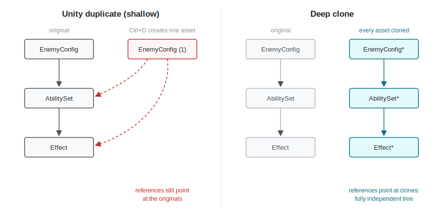
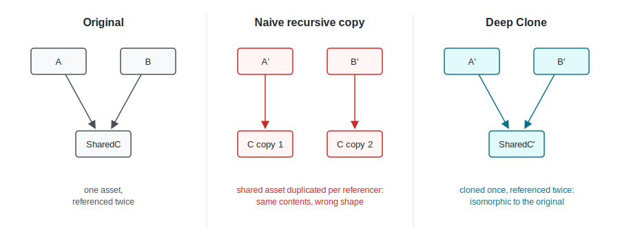
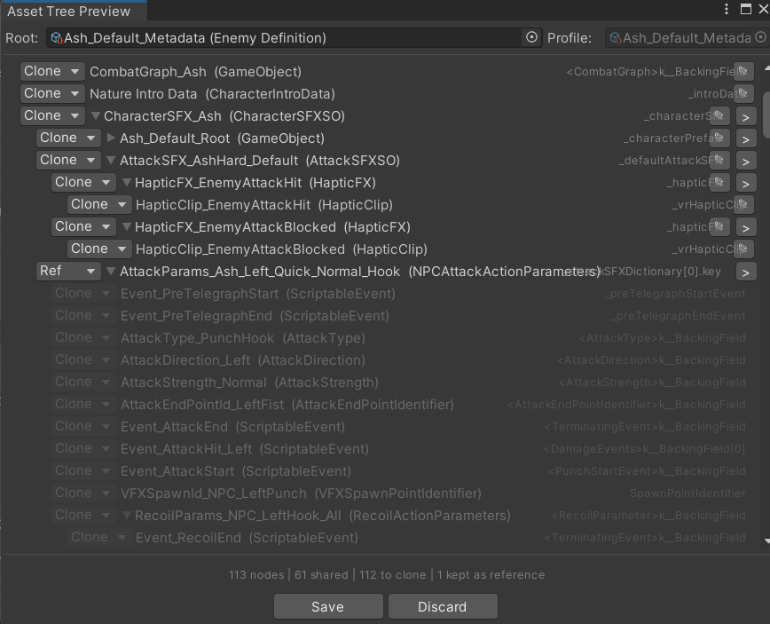
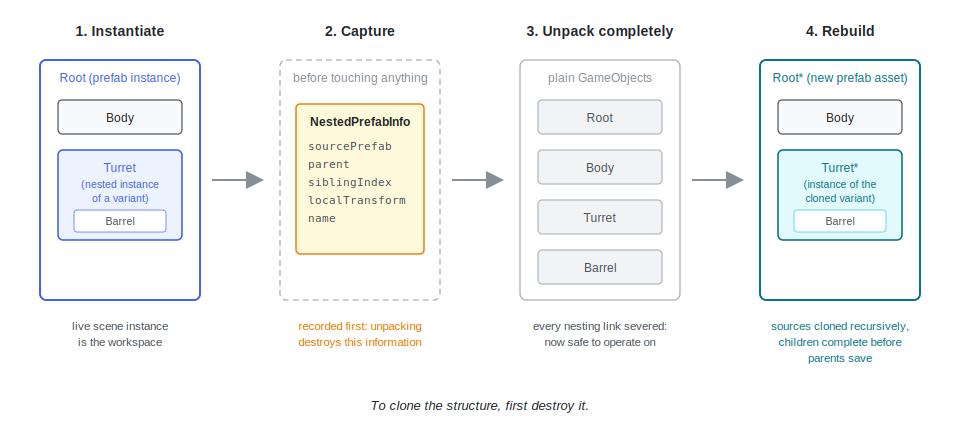

# Deep Clone Lite

This helper allows deep cloning scriptable objects in Unity editor. 
This is a lite version of the full Deep Clone asset which can be found here:

https://assetstore.unity.com/packages/tools/utilities/deep-clone-scriptableobjects-prefabs-321866


For those interested here is a discussion on the full asset.

# Deep Cloning ScriptableObjects and Prefabs in Unity: How It Actually Works

Unity's standard duplicate is a shallow copy. Press Ctrl+D on a ScriptableObject and Unity delivers a new asset, but every reference field still points at the originals. Edit a child on the "copy" and you are editing shared state. For data-driven projects built on template assets, an enemy config referencing an ability set referencing effect definitions, this makes standard duplication nearly useless.



Deep Clone does its own discovery: a reflection walk over every field of the ScriptableObject, recursing into each child ScriptableObject it finds. Each field is shallow copied unless it holds a ScriptableObject or a prefab. A ScriptableObject field triggers recursion; prefab fields branch into a separate pipeline, covered below. The walk also finds children hiding in arrays, lists, and nested serializable classes and structs, so it is thorough by necessity. 

## Why not AssetDatabase.GetDependencies

The obvious starting point is `AssetDatabase.GetDependencies`. Hand it a path, get back everything the asset references, recursively if you like. I never used it, for two reasons.

First, I consider this an opaque area of Unity. The API does not precisely specify what counts as a dependency. The results mix concerns: scripts, implicit importer decisions, things you would never consider part of your data model. When correctness is the goal, you cannot delegate discovery to such an opaque API whose output you cannot fully predict. A missed or misclassified reference in a cloning tool is not a cosmetic bug. It is a silent shallow copy, the exact failure the tool exists to prevent.

Second, cloning amplifies over-collection. For most consumers of GetDependencies, a false positive is noise. For a cloning tool, every false positive becomes a copied file on disk. Pull in a shader, a texture atlas, an editor asset that was never meant to be duplicated, and "clone my enemy config tree" turns into duplicating half the project. The asset sets I originally built this for were already heavy. An over-collecting discovery pass does not degrade gracefully. We get a long wait and then an editor crash.

This tool is for artists and designers, they have a threshold for janky tooling – but push it too far and they will complain bitterly. A programmer tolerates a flaky tool they can debug. A designer uninstalls it and warns their team. That constraint shaped everything downstream: discovery has to be predictable, the operation has to be inspectable before it runs. The aim is for this cloning to be boring in the best sense.

So Deep Clone does its own discovery.

## The reflection walk

So Deep Clone using reflection to do a walk through all the fields in your scriptable object and then recursively walk through all the child SciptableObjects found. Each field is shallow copied unless it holds a ScriptableObject or a prefab. A ScriptableObject field triggers recursion: clone that asset, walk its fields, and so on down the tree. Prefab fields branch into a separate pipeline, covered below.
The recursive walk will also cleverly look for child ScriptableObjects hiding in arrays, lists, custom classes, structs, etc. The walk has to be extra thorough.

Working at field level rather than path level buys the property that defines the whole design: references are built correct at creation time. When the walk reaches a ScriptableObject field, it assigns the cloned child directly into the cloned parent's field. There is no separate rewiring pass, no GUID remapping over serialized text, because there is nothing to rewire. The field is the unit of work, and each field is written once, correctly.

## The identity map

One dictionary sits at the center of the SO pipeline: original asset to cloned asset. The ordering matters. When the walk encounters an asset for the first time, it creates the clone, registers it in the dictionary, and only then populates its fields.

That one mechanism pays off three times.

Shared references stay shared. If AssetA and AssetB both reference SharedC, the walk clones C once on first encounter. The second encounter hits the dictionary and returns the same cloned instance. Both cloned parents reference one cloned C, exactly mirroring the original.

Cycles terminate for free. If A references B and B references A, the walk re-enters A, finds it already registered, and returns the cached clone. No visited set, no cycle detection pass. Termination is a side effect of the identity guarantee, and it works precisely because registration happens before population. Register after, and mutual references either recurse forever or duplicate.

The preview UI comes from the same traversal. The graph the dictionary implies is the graph the preview window renders. There is no second discovery path that could drift from what the clone actually does. What you see is what will happen.

The property the cloned graph has is called isomorphic to the original. Isomorphic means "same shape": a one-to-one mapping between original assets and cloned assets, where every reference between originals has a matching reference between their clones. Nothing more, nothing less.



This is a stronger claim than "everything got copied." A naive recursive copy, the kind you find in old forum threads, fails it two ways. Either it duplicates SharedC once per referencer, quietly changing your data model, or it follows a reference cycle until the stack dies. Same contents, wrong shape.

## The boundary problem

Walking the graph turned out not to be the hard problem. The hard problem is that every reference in the graph is a decision: clone it, or keep it shared. And there is no universally correct answer. A palette of shared materials should stay shared. A stats block should be copied. Only the user knows which is which, and the answer can differ per asset and per clone operation.

The first mechanism was attributes. Mark a field, and the reflection walk honors it during traversal at zero cost. Mechanically this is perfect: the annotation sits exactly where the data is defined, and reflection reads it for free. But attributes fail the actual audience in three ways. They are static, a decision baked into code when the right answer varies per operation. They are invisible, so the user cannot see what will happen until after it happened. And they are gatekept: only a programmer can change them, but the person doing the cloning is a designer.

The clone graph window is the answer to that. The same traversal that powers the clone renders the decision surface itself: the full tree, with clone or share toggled per node, inspected before anything executes. Attributes remain as programmer-set defaults. The window is the per-operation override, made by the person actually doing the cloning, before the operation runs.



The third tier is persistence. User choices are saved to an .asset file keyed by the root asset, so the next clone of the same tree recalls its configuration. Keying by root captures the decision at the granularity it is actually made: "when cloning EnemyTemplate, effects are copied, materials shared" is a property of that tree, not of any field in the abstract. And because it is an asset file rather than an editor preference, it goes into version control. One person's boundary decisions become the team's defaults for that template.

Alongside the per-root state there are Clone Profiles, deliberately created reusable configurations stored as ScriptableObjects. Honest note: these two persistence mechanisms grew separately, and there is an obvious consolidation waiting. Scope for improvement.

## Prefabs: destroy to clone

Prefabs get their own pipeline because the reflection walk cannot see them properly. Nesting is not a field reference. A nested prefab instance is internal prefab structure, invisible to a field-level traversal. And the tools that do understand prefab structure, the `PrefabUtility` APIs, do not mix with reflection. Water and oil. Worse, actively cloning child prefabs while they are still connected inside a parent throws exceptions and does not produce the desired result.

The pipeline that works is counterintuitive: to clone the structure, you first destroy it.

1. Instantiate the original prefab into the scene. Prefab surgery cannot be done on the asset directly, so the live scene instance is the workspace.
2. Before touching anything, find every nested prefab instance root and record its metadata into a `NestedPrefabInfo` struct: source prefab, parent, sibling index, local transform, name. This has to happen first, because the next step destroys exactly the information being recorded.
3. Unpack completely. Every nesting link is severed and the hierarchy flattens into regular GameObjects.
4. For each recorded nested instance: recursively clone its source prefab, destroy the now-regular subtree, and instantiate the cloned prefab in its place, restoring transform, name, and sibling order.
5. Remap the remaining MonoBehaviour fields on non-nested objects through the same field cloning used on the SO side.
6. Save the result as a new prefab asset, destroy the scene instance, and register the original-to-clone pair in a lookup.



That last step matters: the prefab pipeline has its own identity map, with the same memoization the SO side uses. The recursive clone in step 4 checks the lookup first, so a prefab nested in two places clones once, diamond-shaped prefab dependencies keep their shape, and depth is handled by the recursion stack rather than an explicit dependency sort. Children complete before parents save, so the rebuild is effectively bottom-up without ever computing an ordering. It is the same architectural idea applied twice: the isomorphism guarantee spans both asset types.

The detail that cost the most blood is variants. `PrefabUtility` offers several APIs that all sound like they answer "what asset does this instance come from," and they disagree in exactly the case that matters. From the source:

```csharp
// Use GetPrefabAssetPathOfNearestInstanceRoot to correctly resolve prefab variants
// (GetCorrespondingObjectFromOriginalSource would return the ultimate base, not the variant)
```

`GetCorrespondingObjectFromOriginalSource` walks the entire variant chain to the ultimate base. Ask it about a SwordVariant instance and it hands you Sword. Build your metadata on that and the rebuild is silently wrong: the clone re-nests against the base, and every override the variant layer carried, the entire reason the variant exists, evaporates. No exception, no warning. The clone opens fine and has quietly discarded a layer of your data model. `GetPrefabAssetPathOfNearestInstanceRoot` stops at the nearest root, the variant itself, which is the answer cloning actually needs. This is the GetDependencies distrust from the top of the article, made concrete: near-identical APIs embodying different definitions of "source," where picking by name produces silent shallow copying.

One known limitation, visible in the pipeline above: per-instance overrides on nested prefabs, a tweaked component value, a disabled child, are not currently preserved. Step 4 places a fresh instance of the cloned prefab; the modified subtree it replaces was destroyed. Capturing overrides across the unpack boundary is unsolved here, and there is scope to address it. In practice the blast radius is smaller than it sounds: customizations a team intends to keep tend to get promoted into variants, and variant chains are handled correctly. What is lost skews toward one-off tweaks.

Variants are also worth a word as the boundary of this tool. For a single prefab, Create Variant already is a kind of clone, and Unity gives you it for free. But a variant is a linked copy: it shares everything downstream, the same nested prefabs, the same ScriptableObject references, the same materials. Deep Clone exists for the case variants structurally cannot produce, a genuinely independent tree.

## What the design buys

Field-level discovery instead of an opaque dependency API, so the graph contains exactly what the data model says and nothing else. An identity map with create-register-populate ordering, so shared references stay shared and cycles cost nothing, on both asset types. One traversal feeding both the preview and the clone, so the tool cannot show one thing and do another. And boundary decisions moved out of code and into the hands of the people actually doing the cloning, with their choices persisted per tree and shared through version control.

Two things are honestly unfinished: the two persistence mechanisms want consolidating, and nested instance overrides do not yet survive the rebuild.

The tool is [Deep Clone on the Unity Asset Store](https://assetstore.unity.com/packages/tools/utilities/deep-clone-scriptableobjects-prefabs-321866).

Happy to hear any thoughts or discussion on this tooling
